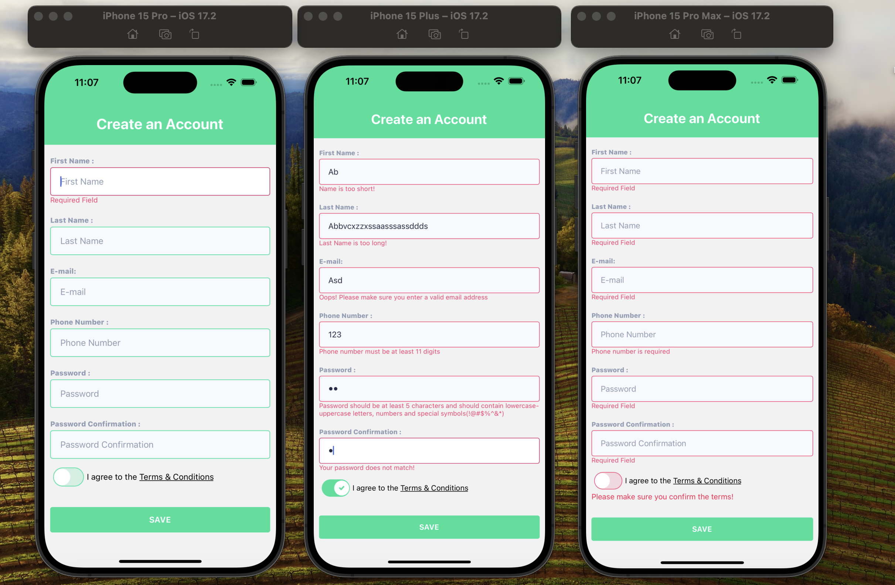
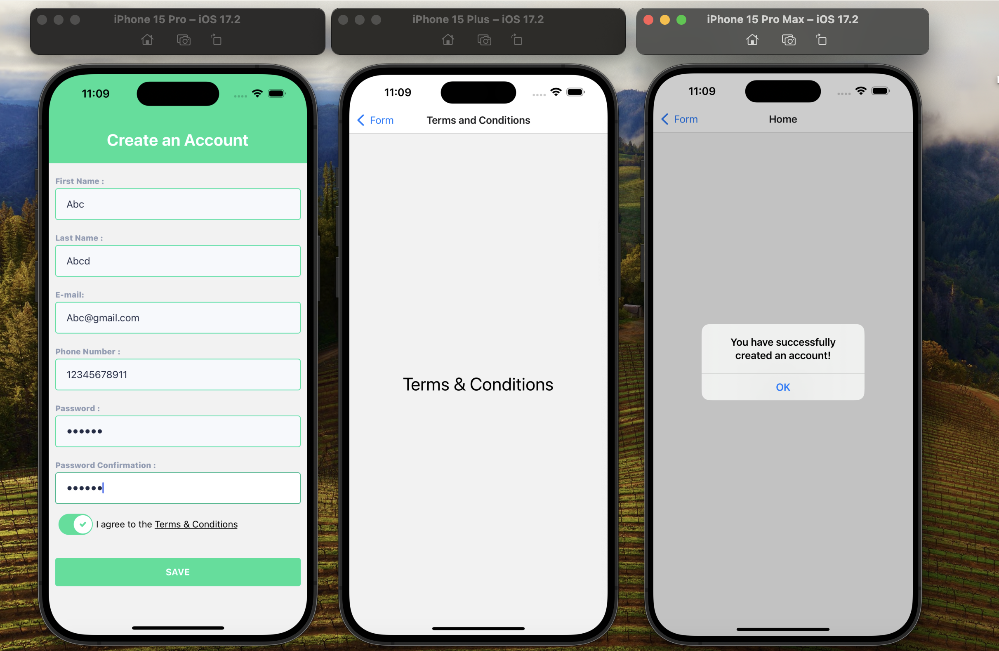

## Account Creation Form

This is an Account Creation Form. It is built using Formik for form management, Yup for form validation, and React Navigation for navigation between screens.
Please look at the gif and photos below for more information.

## Features

- Seamless navigation between form screens.
- Real-time validation and error messages for user inputs.
- Inability to save the account without correctly filling in each input field.

## Libraries Used

- Formik: A library for building forms in React.
- Yup: A library for schema-based form validation.
- React Navigation: A routing and navigation library for React Native.

# SCREEN GIF

# SCREEN VIEW

